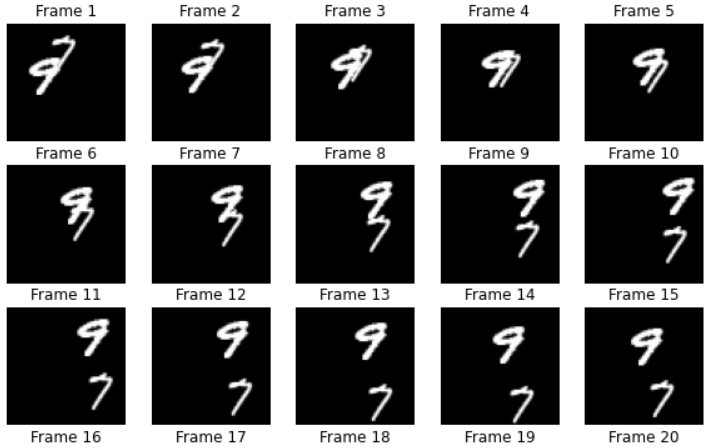

## Introduction
 

The Convolutional LSTM architectures bring together time series processing and computer vision by introducing a convolutional recurrent cell in a LSTM layer. In this example, we will explore the Convolutional LSTM model in an application to next-frame prediction, the process of predicting what video frames come next given a series of past frames.

## Dataset Construction
 

For this example, we will be using the Moving MNIST dataset.
We will download the dataset and then construct and preprocess training and validation sets.

For next-frame prediction, our model will be using a previous frame, which we'll call f_n, to predict a new frame, called f_(n + 1). To allow the model to create these predictions, we'll need to process the data such that we have "shifted" inputs and outputs, where the input data is frame x_n, being used to predict frame y_(n + 1).

## Data Visualization
 

Our data consists of sequences of frames, each of which are used to predict the upcoming frame. Let's take a look at some of these sequential frames.

## model info 
 

To build a Convolutional LSTM model, we will use the ConvLSTM2D layer, which will accept inputs of shape (batch_size, num_frames, width, height, channels), and return a prediction movie of the same shape.

To learn more about [LSTM](https://www.youtube.com/watch?v=QciIcRxJvsM&t=36s)

## utils function 
 

dowload_data--> download the data we used moving mnist from [link]("http://www.cs.toronto.edu/~nitish/unsupervised_video/mnist_test_seq.npy )
extract every frame from the dataset ,extend extra dimention , normalize every frame 

read_yaml --> read the yaml  file and retrun the date in a dictionary 

class SelectCallbacks --> callback class for validation prediction and create the necessary callbacks objects . follwing callbackse are present in this class  model chackpoint , learning learning sheduler , csv logger 

those peram can be controled from config file 

plot_loss --> plot the loss according the epochs 

